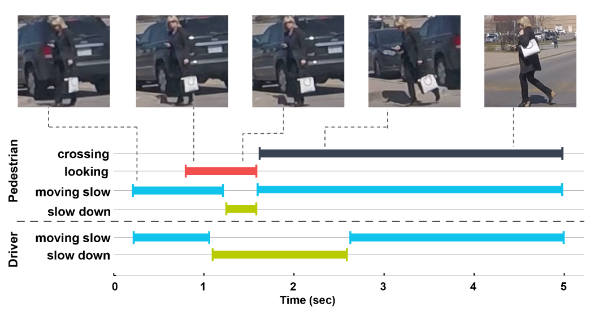

# JAAD 2.0: Annotations and python interface
<p align="center">

</p>
<br/><br/>

This repository contains new annotations for the Joint Attention in Autonomous Driving ([JAAD](http://data.nvision2.eecs.yorku.ca/JAAD_dataset/)) dataset. The annotations are in XML format and can be used with a newly introduced python interface. The original annotations can be found [here](https://github.com/ykotseruba/JAAD_pedestrian/tree/master).  

**Download video clips:** [YorkU server](http://data.nvision2.eecs.yorku.ca/JAAD_dataset/data/JAAD_clips.zip) or [Dropbox](https://www.dropbox.com/sh/zcniegbsxedpcd8/AADiEO7_X4a_bX4S2dHMfYfza?dl=0)

### Table of contents
* [Annotations](#annotations)
* [Video clips](#clips)
* [Interface](#interface)
	* [Dependencies](#dependencies)
	* [Extracting images](#extracting)
	* [Using the interface](#usage)
		* [Parameters](#parameters)
		* [Sequence analysis](#sequence)
		* [Detection](#Detection)
* [Citation](#citation)
* [Authors](#authors)
* [License](#license)

<a name="annotations"></a>
# Annotations
JAAD annotations are organized according to video clip names. There are three types of labels, pedestrians (samples with behavior annnotations), peds (bystanders that are far away and do not interact with the driver) and people (groups of pedestrians). Each pedestrian has a unique id in the form of `0_<video_id>_< pedestrian_number>`. Pedestrians with behavior annotations have a letter 'b' at the end of their id, e.g. `0_1_3b`. The annotations for people also follow the same pattern with the exception of ending with letter 'p', e.g. `0_5_2p`.

All samples are annotated with bounding boxes using two-point coordinates (top-left, bottom-right) `[x1, y1, x2, y2]`. The bounding boxes have corresponding occlusion tags. The occlusion values are either 0 (no occlusion), 1 (partial occlusion >25%) or 2 (full occlusion >75%).

 According to their types, the annotations are divided into 5 groups:<br/>
**Annotations**: These include video attributes (time of day, weather, location), pedestrian bounding box coordinates, occlusion information and activities (e.g. walking, looking). The activities are provided only for a subset of pedestrians. These annotations are one per frame per label.<br/>
**Attributes** (pedestrians with behavior annotations only): These include information regarding pedestrians' demographics, crossing point, crossing characteristics, etc. These annotations are one per pedestrian.<br/>
**Appearance** (videos with high visibility only): These include information regarding pedestrian appearance such as pose, clothing, objects carreid (see `_get_ped_appearance()` for more details).  These annotations are one per frame per pedestrian.<br/>
**Traffic**: These provide information about traffic, e.g. signs, traffic light, for each frame. These annotations are one per frame.<br/>
**Vehicle**: These are vehicle actions, e.g. moving fast, speeding up, per each frame.<br/>

<a name="clips"></a>
# Video clips
JAAD contains 346 video clips. These clips should be downloaded and placed in `JAAD_clips` folder as follows:
```
JAAD_clips/video_0001.mp4
JAAD_clips/video_0002.mp4
...
```
To download the videos, either run script `download_clips.sh` or manually download the clips from [here](http://data.nvision2.eecs.yorku.ca/JAAD_dataset/data/JAAD_clips.zip) or [here](https://www.dropbox.com/sh/zcniegbsxedpcd8/AADiEO7_X4a_bX4S2dHMfYfza?dl=0) and extract the zip archive.

<a name="interface"></a>
# Interface

<a name="dependencies"></a>
## Dependencies
The interface is written and tested using python 3.5. The interface also requires
the following external libraries:<br/>
* opencv-python
* numpy
* scikit-learn

<a name="extracting"></a>
## Extracting images
In order to use the data, first, the video clips should be converted into images. This can be done using script `split_clips_to_frames.sh` or via interface as follows:
```
from jaad_data import JAAD
jaad_path = <path_to_the_dataset_root_folder>
imdb = JAAD(data_path=jaad_path)
imdb.extract_and_save_images()
```

Using either of the methods will create a folder called `images` and save the extracted images grouped by corresponding video ids in the folder.
```
images/video_0001/
				00000.png
				00001.png
				...
images/video_0002/
				00000.png
				00001.png
				...		
...
```

<a name="usage"></a>
## Using the interface
<a name="parameters"></a>
Upon using any methods to extract data, the interface first generates a database (by calling `generate_database()`) of all annotations in the form of a dictionary and saves it as a `.pkl` file in the cache directory (the default path is `JAAD/data_cache`). For more details regarding the structure of the database dictionary see comments in the `jaad_data.py` for function `generate_database()`.

### Parameters
The interface has the following configuration parameters:
```
data_opts = {'fstride': 1,
             'sample_type': 'all',  
	     'subset': 'high_visibility',
             'data_split_type': 'default',
             'seq_type': 'trajectory',
	     'height_rng': [0, float('inf')],
	     'squarify_ratio': 0,
             'min_track_size': 0,
             'random_params': {'ratios': None,
                               'val_data': True,
                               'regen_data': True},
             'kfold_params': {'num_folds': 5, 'fold': 1}}
```
*'fstride'*.  This is used for sequence data. The stride specifies the sampling resolution, i.e. every nth frame is used
for processing.<br/>
*'sample_type'*. This method specifies whether to extract `all` the pedestrians or only the ones with behavior data (`beh`).<br/>
*'subset'*. Specifies which subset of videos to use based on degree of visibility and resolution.
*'data_split_type'*. The JAAD data can be split into train/test or val in three different ways. `default` uses the predefined train/val/test split specified in `.txt` files in `split_ids` folder. `random` randomly divides pedestrian ids into train/test (or val) subsets depending on `random_params` (see  method `_get_random_pedestrian_ids()` for more information). `kfold` divides the data into k sets for cross-validation depending on `kfold_params` (see  method `_get_kfold_pedestrian_ids()` for more information).<br/>
*'seq_type'*. Type of sequence data to generate (see [Sequence analysis](#sequence)).
*'height_rng'*. These parameters specify the range of pedestrian scales (in pixels) to be used. For example  `height_rng': [10, 50]` only uses pedestrians within the range of 10 to 50 pixels in height.<br/>
*'squarify_ratio'*. This parameter can be used to fix the aspect ratio (width/height) of bounding boxes. `0` the original bounding boxes are returned.<br/>
*'min_track_size'*. The minimum allowable sequence length in frames. Shorter sequences will not be used.


<a name="sequence"></a>
### Sequence analysis
There are three built-in sequence data generators accessed via `generate_data_trajectory_sequence()`. The type of sequences generated are `trajectory`, `intention` and `crossing`. To create a custom data generator, follow a similar structure and add a function call to `generate_data_trajectory_sequence()` in the interface.

<a name="detection"></a>
### Detection
The interface has a method called `get_detection_data()` which can be used to generate detection data. Currently, there are four build-in methods specified which either return data or produce and save data lists for models (see `get_detection_data()` for more information).

<a name="citation"></a>
# Citation
If you use our dataset, please cite:
```
@inproceedings{rasouli2017they,
  title={Are They Going to Cross? A Benchmark Dataset and Baseline for Pedestrian Crosswalk Behavior},
  author={Rasouli, Amir and Kotseruba, Iuliia and Tsotsos, John K},
  booktitle={ICCVW},
  pages={206--213},
  year={2017}
}

@inproceedings{rasouli2018role,
  title={It’s Not All About Size: On the Role of Data Properties in Pedestrian Detection},
  author={Rasouli, Amir and Kotseruba, Iuliia and Tsotsos, John K},
  booktitle={ECCVW},
  year={2018}
}
```
<a name="authors"></a>
## Authors

* **[Amir Rasouli](http://www.cse.yorku.ca/~aras/index.html)**
* **[Iuliia Kotseruba](http://www.cse.yorku.ca/~yulia_k/)**

Please send email to yulia_k@eecs.yorku.ca or arasouli.ai@gmail.com if there are any problems with downloading or using the data.

<a name="license"></a>
## License
This project is licensed under the MIT License - see the [LICENSE](LICENSE) file for details.

The video clips are licensed under [Creative Commons Attribution 4.0 International License](http://creativecommons.org/licenses/by/4.0/). 
