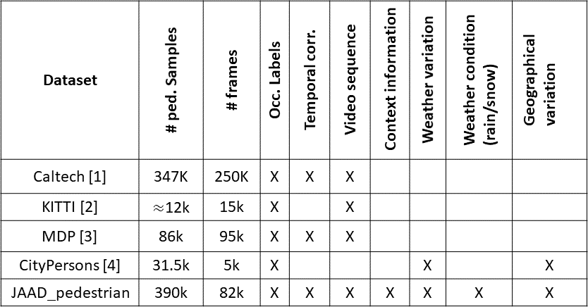

# JAAD Pedestrian Detection Benchmark
<p align="center">

</p>
<br/><br/>

JAAD Pedestrian Detection Benchmark is an extension of the [JAAD](http://data.nvision2.eecs.yorku.ca/JAAD_dataset/)  dataset annotated for detection of pedestrians under various conditions. The annotations are avaiable for the entire JAAD dataset comprising over 390K pedestrian samples in traffic scenes. A comparison of JAAD dataset with current state-of-the-art pedestrian detection benchmark datasets can be found in the table below.

<p align="center">

</p>

## Image samples
The image samples can be downloaded from the [JAAD](http://data.nvision2.eecs.yorku.ca/JAAD_dataset/) webpage. The data comes as video sequences in both `.mp4`, and `.seq` format similar to the [Caltech](http://www.vision.caltech.edu/Image_Datasets/CaltechPedestrians/) dataset.

JAAD contains 346 high-resolution video clips generating approximately 82k image samples. The JAAD data is collected in different geographical locations and under various weather conditions such as clear, rainy or snowy.

To convert the video clips to image sequences, use the script 'split_clips_to_frames.sh'.

## Bounding boxes
The bounding boxes are provided for all pedestrians in the videos (and very few vehicles) in vbb format which require a [Piotr Dollar's Toolbox](https://pdollar.github.io/toolbox/). All pedestrian samples in every image are annotated with a unique id allowing one to track each sample across video sequences.

There are two folders with bounding boxes.  
* vbb_part: contains bounding boxes with occlusion flags set to 1 for partial or full occlusion (partial occlusion is defined when between 25% and 75% of the object is covered, full occlusion is set when >75% of the object is covered).  
* vbb_full: contains bounding boxes ONLY with full occlusion.  

To open vbb files in Matlab use the following command from the toolbox:
```
A = vbb('vbbLoad', 'vbb_part/video_0001.vbb');
```

There are three types of labels in the vbb files:  
* car, car1, car2, ... - vehicles (only few vehicles that interact directly with the driver are labeled)  
* pedestrian, pedestrian1, pedestrian2, ... - pedestrians with behavioral tags  
* ped1, ped2, .... - other pedestrians visible in the scene (bystanders) without behavioral tags and attributes  

To view vbb boxes with `.seq` files use the vbbLabeler utility provided with the toolbox.

For experimentation with the dataset and use different subsets of the dataset please use our [Pedestrian Benchmark Framework (PBF)](https://github.com/aras62/PBF).


### Citing us

If you use our dataset in your research, please consider citing:

```
@inproceedings{rasouli2017they,
  title={Are They Going to Cross? A Benchmark Dataset and Baseline for Pedestrian Crosswalk Behavior},
  author={Rasouli, Amir and Kotseruba, Iuliia and Tsotsos, John K},
  booktitle={Proceedings of the IEEE Conference on Computer Vision and Pattern Recognition},
  pages={206--213},
  year={2017}
}

@inproceedings{rasouli2018role,
  title={It’s Not All About Size: On the Role of Data Properties in Pedestrian Detection},
  author={Rasouli, Amir and Kotseruba, Iuliia and Tsotsos, John K},
  booktitle={ECCVW},
  year={2018}
}
```

## Authors

* **Amir Rasouli**
* **Yulia Kotseruba**

Please send email to yulia_k@cse.yorku.ca or aras@cse.yorku.ca if there are any problems with downloading or using the data.

## License

This project is licensed under the MIT License - see the [LICENSE](LICENSE) file for details

## References
[1] P. Dollar, C. Wojek, B. Schiele, and P. Perona. Pedestrian detection: A benchmark. In CVPR, pages 304–311, 2009

[2] A. Geiger, P. Lenz, C. Stiller, and R. Urtasun. Vision meets robotics: The kitti dataset. The International Journal of Robotics Research, 32(11):1231–1237, 2013.

[3] S. Hwang, J. Park, N. Kim, Y. Choi, and I. So Kweon. Multispectral pedestrian detection: Benchmark dataset and baseline. In CVPR, pages 1037–1045, 2015.

[4] S. Zhang, R. Benenson, and B. Schiele. Citypersons: A diverse dataset for pedestrian detection. In CVPR, pages 4457-4465, 2017.
